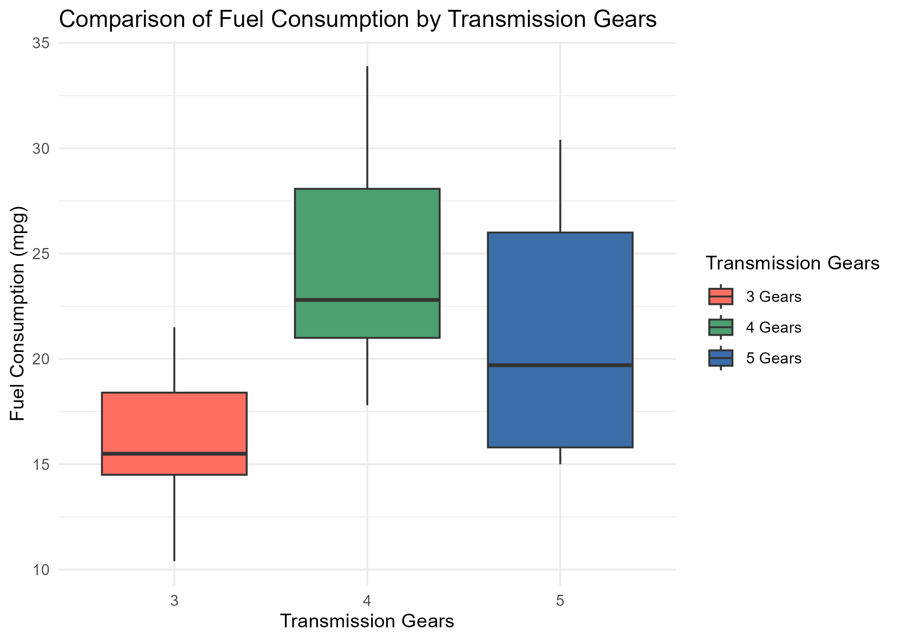
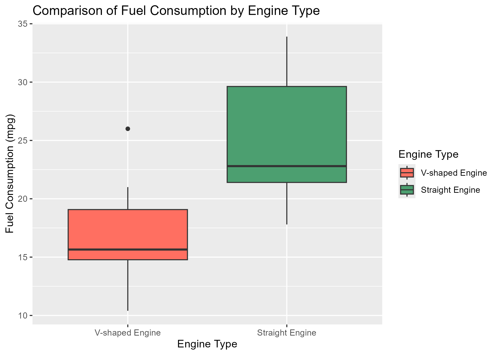

# 🚗 Car Fuel Efficiency & Performance Analysis (mtcars Dataset)

This project analyzes the classic **mtcars** dataset from the 1974 Motor Trend US magazine.  
The dataset contains fuel consumption and automobile design features for **32 cars (1973–74 models)**.

📂 Dataset Reference: [mtcars documentation](https://www.rdocumentation.org/packages/datasets/versions/3.6.2/topics/mtcars)

---

## 📊 Project Overview
As a **Data Analyst**, I was tasked with exploring fuel efficiency and performance in cars by answering the following case studies:

1. **Fuel efficiency by transmission gears (3, 4, 5):**  
   - 4-gear cars show the highest median mpg (most fuel-efficient).  
   - 5-gear cars have wider variability in mpg.  
   - 3-gear cars are more consistent but less efficient.  

2. **Fuel efficiency of sport (vs=0) vs non-sport (vs=1) cars:**  
   - Non-sport cars (vs=1) are more fuel-efficient on average.  
   - Sport cars (vs=0) have lower mpg but more consistent results.  

3. **Relationship between car weight and horsepower:**  
   - Positive correlation: heavier cars generally have more horsepower.  
   - Outliers identified:  
     - Muscle cars (medium weight, very high horsepower).  
     - Economy cars (very light, low horsepower).  
     - Heavy cars with moderate horsepower (inefficient).  
     - One light non-sport car with unusually high horsepower (possible safety issue).  

---

## 🛠️ Tools & Methods
- **R programming** (`ggplot2`, `plotly`)  
- **Boxplots** for distribution & median analysis  
- **Scatterplots** for correlation analysis  

---

## 🌱 Key Insights & Recommendations
- **4-gear cars** offer the best balance of efficiency and practicality.  
- **Non-sport cars** should be prioritized for fuel-efficient product lines.  
- **Engineering teams** should ensure proper balance of weight and horsepower to avoid inefficiencies or safety risks.  

---

## 📷 Example Visualizations
  
  
  
